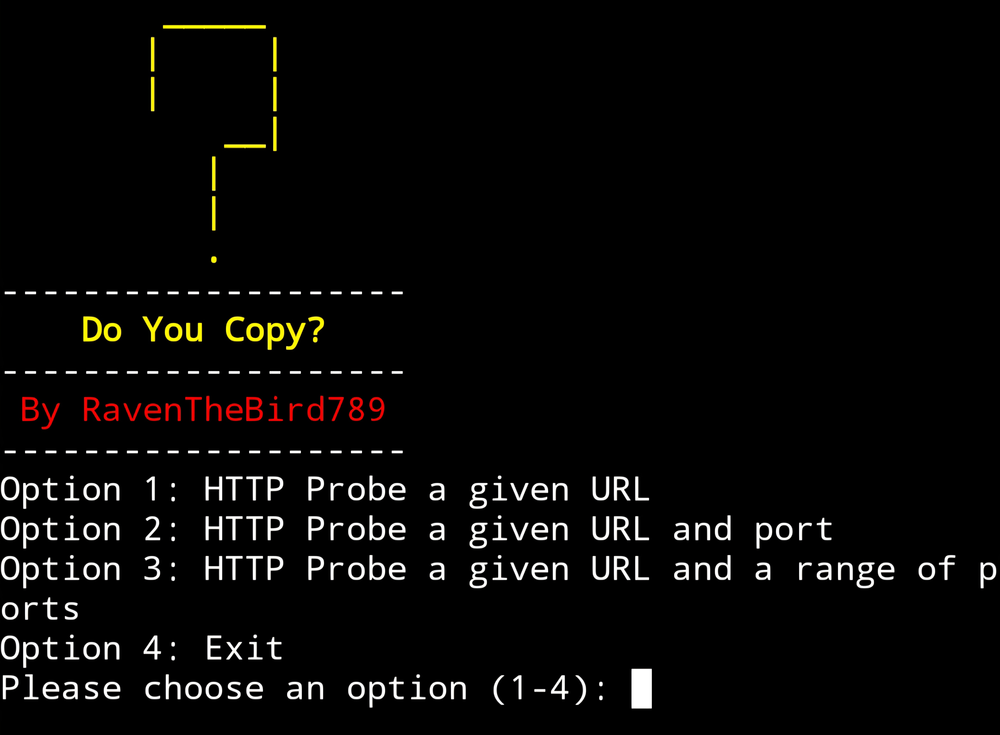

# Do-You-Copy
Python script for a HTTP Probing Reconnaissance Tool

Prerequisites
* Ensure that the latest version of python is installed in your terminal (python 3.x)
* Ensure you have a virtual env for the required python libraries (If you don't, one can easily be created by executing the command "python3 -m venv env")

Recommendations
* Use a VPN while using this tool (Proton or Mullvad are encouraged)
* Enable TOR in your terminal
* Run proxychains4 while executing the software (This comes pre-installed with Kali-Linux)

Installation
1. To install, simply type "git clone https://github.com/RavenTheBird789/Do-You-Copy" in your terminals command line
2. Execute the command "source env/bin/activate" to activate your virtual env
3. Execute the command "cd Do-You-Copy" to enter the directory of this project
4. While in the "Do-You-Copy" directory execute the command "pip install -r requirements.txt"

Execution of Software
* To run the program, simply type "python3 do_you_copy.py" in your terminals command line (Note: a shortcut can be created in a terminal session using the bash alias command. Ex: alias hp="python3 do_you_copy.py")

Important Information:
* You must paste or type the hostname or URL of the website that you're probing (ex: https://example.com or example.com instead of just example) otherwise, you'll get an error
* KeyboardInterrupt (Ctrl + C) can be used to stop the program from running while probing the given URL
