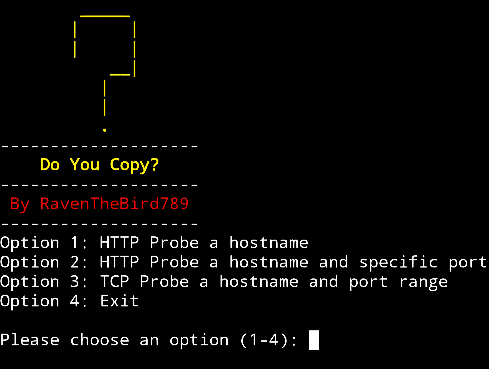

# Do You Copy ⁉️
HTTP Probing Reconnaissance Tool



Requirements
* Ensure that the latest version of python is installed in your terminal (python 3.x)

Recommendations
* Use a VPN while using this tool (Proton or Mullvad are encouraged)
* Enable TOR in your terminal
* Run proxychains4 while executing the software (This comes pre-installed with Kali-Linux)

Installation & setup

```bash
git clone https://github.com/RavenTheBird789/Do-You-Copy
cd Do-You-Copy
python3 -m venv env
source env/bin/activate
pip install -r requirements.txt
```

To run

```bash
python3 do_you_copy.py
```

Optional shortcut

```bash
python3 do_you_copy.py
```

Notes:
* You must paste or type the hostname or URL of the website that you're probing (ex: https://example.com or example.com instead of just example) otherwise, you'll get an error
* KeyboardInterrupt (Ctrl + C) can be used to stop the program from running while probing the given hostname or URL
* If no input is provided for the start and end ports for Option 3, the default values will be 0 and 1024 respectively
